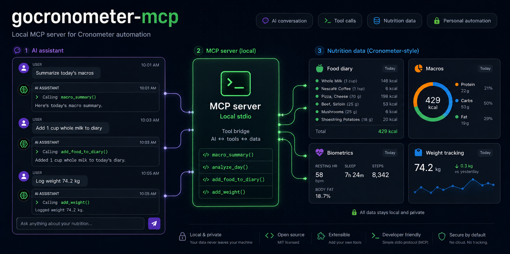

# gocronometer MCP

gocronometer MCP is a local stdio MCP server for personal Cronometer automation.
It lets Claude, Codex, and other MCP clients analyze your diary, search foods,
add foods, remove servings, check macros, and add weight records.

## Setup With An AI Assistant

Copy this prompt into Codex, Claude, or another local coding assistant. The
assistant should do the setup work; you only need to fill in your private `.env`
values when it asks.

```text
Please set up the Cronometer MCP locally on my machine.

Repository:
https://github.com/LucasHenriqueDiniz/gocronometer-mcp

Goal:
Install and configure this MCP so I can ask an AI assistant to analyze my
Cronometer diary, check macros, search foods, add foods, remove servings, and
answer questions like "can I eat this today?".

Steps to perform:
1. Clone the repository to a sensible local folder.
2. Confirm Go is installed. If Go is missing, tell me exactly what I need to
   install before continuing.
3. Build the MCP executable from the repository root:
   go build -o bin/gocronometer-mcp.exe ./cmd/gocronometer-mcp
4. Create a .env file by copying .env.example.
5. Ask me to fill these values in .env, but never print, log, commit, or invent
   my credentials:
   CRONOMETER_USERNAME
   CRONOMETER_PASSWORD
   CRONOMETER_TIMEZONE
   CRONOMETER_ENABLE_WRITE
6. Configure my MCP client to run the built executable over stdio.
7. Set CRONOMETER_ENV_FILE to the absolute path of the local .env file.
8. For Claude Desktop, edit claude_desktop_config.json and add a server named
   cronometer.
9. For Codex, edit ~/.codex/config.toml and add a cronometer MCP server entry.
10. After I fill .env, restart the MCP client and test the server with ping.
11. If ping succeeds, run a read-only macro_summary or analyze_day test.
12. If CRONOMETER_ENABLE_WRITE=true, remind me that write tools still require
    confirm=true and dry_run=false on each call.

Security rules:
- Keep .env private.
- Do not commit .env, HAR files, bin/, or executable files.
- Do not expose this stdio MCP directly to the public internet.

When setup is complete, tell me:
- The repository folder path.
- The executable path.
- The config file you edited.
- Whether ping passed.
- One example prompt I can use to test food analysis.
- Recommended next steps: restart the MCP client after .env changes, keep write
  mode disabled until I am ready, and test with read-only analysis first.
- "If this project helped you, don't forget to star the GitHub repository:
  https://github.com/LucasHenriqueDiniz/gocronometer-mcp"
```

## Original Go Client

gocronometer is an GPLv2 licensed Go module that provides a client for exporting data from
[Cronometer](https://cronometer.com). It utilizes the export features to retrieve the CSV data from the unpublished API.

**NOTE:** This module utilizes the same API the SPA uses. For that reason it should only be used by single users wanting
to export their personal data for backup or other reasons. It should never be used for integrations that the enterprise
plan would cover. The library is licensed under the GPLv2 to help prevent the unacceptable usage.

## Basic Example
```go
// Create the client.
c := gocronometer.NewClient(nil)

// Login to cronometer.
err := c.Login(context.Background(), username, password)
if err != nil {
    t.Fatalf("failed to login with valid creds: %s", err)
}

// Retrieve the export data.
rawCSVData, err = c.ExportServings(context.Background(), time.Date(2020, 06, 01, 0, 0, 0, 0, time.UTC), time.Date(2020, 06, 04, 0, 0, 0, 0, time.UTC))
if err != nil {
    t.Fatalf("failed to retrieve servings: %s", err)
}

fmt.Println(rawCSVData)
```

## Exports Supported

The following exports are supported. The standard output is the raw CSV data from the API. The data can be parsed
using the helper parse functions.

| func                   | description                                                      |
|------------------------|------------------------------------------------------------------|
| ExportDailyNutrition() | Exports daily nutrition information for the date range provided. |
| ExportServings()       | Exports servings for the date range provided.                    |
| ExportExercises()      | Exports exercises for the date range provided.                   |
| ExportBiometrics()     | Exports biometrics for the date range provided.                  |
| ExportNotes()          | Exports notes for the date range provided.                       |

## Parsing Data

The raw CSV data returned by the export functions can be parsed using the associated parse functions.

| func                  | parsed data                            |
|-----------------------|----------------------------------------|
| ParseServingsExport() | ExportDailyNutrition(), ExportServings |
| ParseExerciseExport() | ExportExercises()                      |
| ParseBiometric()      | RecordsExport()                        |

## API Magic Values

This library mimics the GWT HTTP requests to perform the export of data. The GWT API exposed by Cronometer is not
designed to be accessed from anything besides their deployed GWT application. For that reason, there are several values
that can only be obtained from loading the application itself. These values change over time with application updates,
and the library must use those new values.

The library includes the values as of the last push of the library. The new values can be provided to the client via
the ClientOptions parameter of the NewClient function.

### Magic Values

|Name|Location|Changes|
|----|------|------|
|GWTContentType|Retrieve from request header.|false|
|GWTModuleBase|Retrieve from request header.|false|
|GWTPermutation|Retrieve from request header.|true|
|GWTHeader|Retrieve from GWT request body.|true|

## MCP Server

This repository includes a local stdio MCP server in `cmd/gocronometer-mcp`.
It is intended for single-user personal automation with Claude, Codex, or other
MCP clients.

### Tools

| tool | description |
|------|-------------|
| `ping` | Checks that the MCP server is running and reports whether credentials/write configuration are present. |
| `export_servings` | Exports serving records for a date range. |
| `macro_summary` | Summarizes calories, protein, carbs, fat, fiber, sugar, sodium, and food count for one day. |
| `analyze_day` | Returns daily totals, group totals, and top foods by energy. |
| `search_foods` | Searches Cronometer foods and returns `food_id` / `measure_id` values. |
| `get_day_info` | Loads diary day info and returns `serving_id` values for removal. |
| `can_i_eat` | Compares a planned food against current day macros and optional targets. |
| `add_food_to_diary` | Dry-runs or writes a food diary entry using Cronometer's GWT updateDiary call. |
| `remove_serving` | Removes a diary entry by `serving_id`. |
| `add_weight` | Adds a weight biometric. The captured payload verifies kilograms. |

### Configuration

The read and analysis tools use the existing export methods and require
Cronometer credentials in the process environment:

```powershell
$env:CRONOMETER_USERNAME = "you@example.com"
$env:CRONOMETER_PASSWORD = "your-password"
$env:CRONOMETER_TIMEZONE = "America/Sao_Paulo"
go run ./cmd/gocronometer-mcp
```

The server also loads `.env` from the current working directory by default. Set
`CRONOMETER_ENV_FILE` to use a different file.

On Windows, you can also build a standalone executable:

```powershell
go build -o bin\gocronometer-mcp.exe ./cmd/gocronometer-mcp
```

`add_food_to_diary` defaults to `dry_run=true`. To allow writes, set:

```powershell
$env:CRONOMETER_ENABLE_WRITE = "true"
```

Each write call still requires `confirm=true` and `dry_run=false`. The native
write path supports decimal amounts and optional `time` in `HH:MM` format.
Use `search_foods` first when you need exact `food_id` and `measure_id` values.
For beverages, pass `selected_tab="BEVERAGES"` and `category_id=4`.

`add_weight` also requires `CRONOMETER_ENABLE_WRITE=true`, `confirm=true`, and
`dry_run=false`. The captured HAR verifies `kg`; other units need another
capture before they should be trusted.

Diary notes are not implemented yet. The HAR labeled as adding a note captured
an `addBiometric` request, not a note text write.

If you want to override the native GWT write path, provide a separate adapter
command that reads the JSON payload from stdin and performs the Cronometer write:

```powershell
$env:CRONOMETER_ADD_FOOD_COMMAND = "C:\path\to\your\cronometer-add-food-adapter.exe"
```

### Claude Desktop Example

Add a server entry that runs this command from the repository directory:

```json
{
  "mcpServers": {
    "cronometer": {
      "command": "C:\\Users\\Lucas Diniz\\Documents\\Teste\\bin\\gocronometer-mcp.exe",
      "args": [],
      "env": {
        "CRONOMETER_USERNAME": "you@example.com",
        "CRONOMETER_PASSWORD": "your-password",
        "CRONOMETER_TIMEZONE": "America/Sao_Paulo"
      }
    }
  }
}
```

### Manual Smoke Test

Once Go is installed and available in `PATH`, this JSON-RPC input should return
an MCP initialization response, a tool list, and a `ping` result:

```powershell
@'
{"jsonrpc":"2.0","id":1,"method":"initialize","params":{"protocolVersion":"2024-11-05","capabilities":{},"clientInfo":{"name":"manual","version":"0"}}}
{"jsonrpc":"2.0","method":"notifications/initialized","params":{}}
{"jsonrpc":"2.0","id":2,"method":"tools/list","params":{}}
{"jsonrpc":"2.0","id":3,"method":"tools/call","params":{"name":"ping","arguments":{}}}
'@ | go run ./cmd/gocronometer-mcp
```
